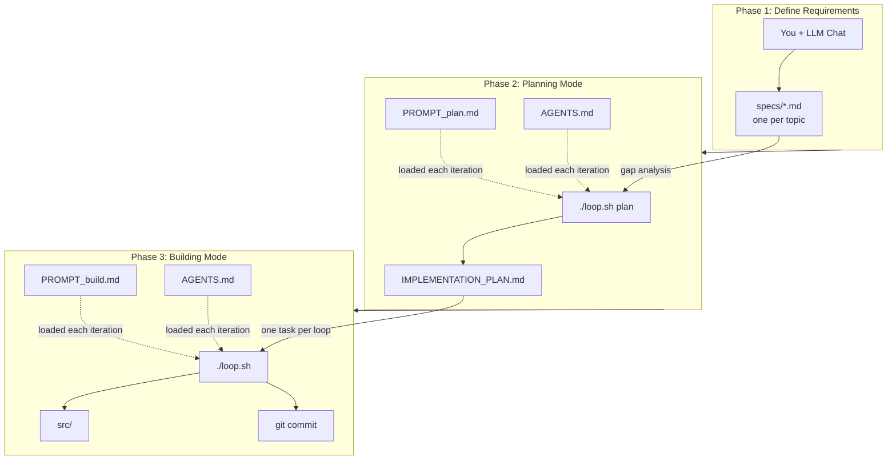

# Ralph Loop

Autonomous AI coding via a bash loop with fresh context each iteration. Based on [The Ralph Playbook](https://ghuntley.com/ralph/).

## How It Works

```
┌─────────────────────────────────────────────────────────────────────────────┐
│                         3 Phases, 2 Prompts, 1 Loop                         │
└─────────────────────────────────────────────────────────────────────────────┘

     ┌──────────────────────┐
     │   PHASE 1: DEFINE    │
     │    REQUIREMENTS      │
     │   (you + LLM chat)   │
     └──────────┬───────────┘
                │
                ▼
         ┌─────────────┐
         │   specs/    │  ◄── one file per topic of concern
         │   *.md      │
         └─────────────┘
                │
                ▼
     ┌──────────────────────┐      ┌─────────────────┐
     │   PHASE 2: PLAN      │      │  PROMPT_plan.md │
     │   `./loop.sh plan`   │◄────►│                 │
     │                      │      │  AGENTS.md      │
     │   Gap analysis only  │      └─────────────────┘
     └──────────┬───────────┘
                │
                ▼
       ┌────────────────────┐
       │ IMPLEMENTATION_    │  ◄── Ralph generates this
       │ PLAN.md            │
       └────────┬───────────┘
                │
                ▼
     ┌──────────────────────┐      ┌─────────────────┐
     │   PHASE 3: BUILD     │      │ PROMPT_build.md │
     │   `./loop.sh`        │◄────►│                 │
     │                      │      │  AGENTS.md      │
     │  One task per loop   │      └─────────────────┘
     └──────────┬───────────┘
                │
      ┌─────────┴─────────┐
      │                   │
      ▼                   ▼
  ┌───────┐         ┌─────────┐
  │ src/  │         │  git    │
  │ code  │         │ commit  │
  └───────┘         └─────────┘
```

Each loop iteration gets fresh context. No confusion buildup. The plan file on disk is the shared state between iterations.

### Diagram (Mermaid)



## Quick Start

```bash
# Initialize in your project
scripts/init_ralph.sh /path/to/project
cd /path/to/project

# 1. Edit PROMPT_plan.md — replace [project-specific goal]
# 2. Edit AGENTS.md — add your build/test/lint commands
# 3. Write specs in specs/ (one per topic of concern)

# Generate the plan
./loop.sh plan

# Build from the plan
./loop.sh
```

## File Structure

```
project-root/
├── loop.sh              # The loop (plan/build modes)
├── PROMPT_plan.md       # Planning prompt
├── PROMPT_build.md      # Building prompt
├── AGENTS.md            # Operational guide (build/test commands)
├── IMPLEMENTATION_PLAN.md  # Generated by Ralph
├── specs/               # One spec per topic of concern
└── src/                 # Your code
```

## Loop Modes

| Command | Mode | Purpose |
|---|---|---|
| `./loop.sh plan` | Planning | Gap analysis, generates plan |
| `./loop.sh plan 5` | Planning | Max 5 iterations |
| `./loop.sh` | Building | Implements from plan |
| `./loop.sh 20` | Building | Max 20 iterations |

## Key Ideas

- **Two prompts, one loop**: Swap between planning and building by passing `plan` argument
- **AGENTS.md**: Operational guide with build/test commands. Loaded every iteration. Keep it brief.
- **Plan is disposable**: Wrong plan? Delete it, run `./loop.sh plan` again
- **Subagents as memory**: Fan out reads/searches to subagents, keep main context clean
- **Backpressure**: Tests/builds reject bad work. AGENTS.md wires in project-specific commands.

## Credits

Based on [Geoffrey Huntley's Ralph](https://ghuntley.com/ralph/). Organized via [Clayton Farr's Ralph Playbook](https://github.com/ClaytonFarr/ralph-playbook).
