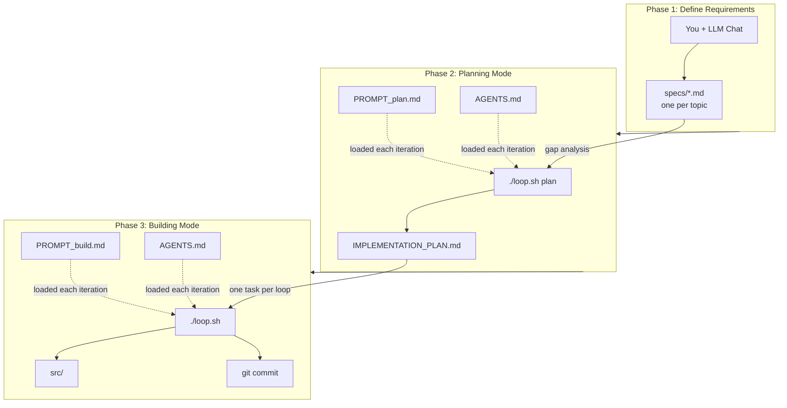

# Ralph Loop

Autonomous AI coding via a bash loop with fresh context each iteration. Based on [The Ralph Playbook](https://ghuntley.com/ralph/).

## How It Works

```
┌─────────────────────────────────────────────────────────────────────────────┐
│                         3 Phases, 2 Prompts, 1 Loop                         │
└─────────────────────────────────────────────────────────────────────────────┘

     ┌──────────────────────┐
     │   PHASE 1: DEFINE    │
     │    REQUIREMENTS      │
     │   (you + LLM chat)   │
     └──────────┬───────────┘
                │
                ▼
         ┌─────────────┐
         │   specs/    │  ◄── one file per topic of concern
         │   *.md      │
         └─────────────┘
                │
                ▼
     ┌──────────────────────┐      ┌─────────────────┐
     │   PHASE 2: PLAN      │      │  PROMPT_plan.md │
     │   `./loop.sh plan`   │◄────►│                 │
     │                      │      │  AGENTS.md      │
     │   Gap analysis only  │      └─────────────────┘
     └──────────┬───────────┘
                │
                ▼
       ┌────────────────────┐
       │ IMPLEMENTATION_    │  ◄── Ralph generates this
       │ PLAN.md            │
       └────────┬───────────┘
                │
                ▼
     ┌──────────────────────┐      ┌─────────────────┐
     │   PHASE 3: BUILD     │      │ PROMPT_build.md │
     │   `./loop.sh`        │◄────►│                 │
     │                      │      │  AGENTS.md      │
     │  One task per loop   │      └─────────────────┘
     └──────────┬───────────┘
                │
      ┌─────────┴─────────┐
      │                   │
      ▼                   ▼
  ┌───────┐         ┌─────────┐
  │ src/  │         │  git    │
  │ code  │         │ commit  │
  └───────┘         └─────────┘
```

Each loop iteration gets fresh context. No confusion buildup. The plan file on disk is the shared state between iterations.

### Diagram (Mermaid)


```mermaid
flowchart TB
    subgraph P1["Phase 1: Define Requirements"]
        chat["You + LLM Chat"]
        specs["specs/*.md<br/>one per topic"]
        chat --> specs
    end

    subgraph P2["Phase 2: Planning Mode"]
        plan_cmd["./loop.sh plan"]
        prompt_plan["PROMPT_plan.md"]
        agents1["AGENTS.md"]
        impl_plan["IMPLEMENTATION_PLAN.md"]

        prompt_plan -.->|loaded each iteration| plan_cmd
        agents1 -.->|loaded each iteration| plan_cmd
        specs -->|gap analysis| plan_cmd
        plan_cmd --> impl_plan
    end

    subgraph P3["Phase 3: Building Mode"]
        build_cmd["./loop.sh"]
        prompt_build["PROMPT_build.md"]
        agents2["AGENTS.md"]
        src["src/"]
        commit["git commit"]

        prompt_build -.->|loaded each iteration| build_cmd
        agents2 -.->|loaded each iteration| build_cmd
        impl_plan -->|one task per loop| build_cmd
        build_cmd --> src
        build_cmd --> commit
    end

    P1 --> P2 --> P3
```

## Install the Skill

Copy the `ralph-loop/` directory into your Claude Code skills folder:

```bash
# Clone this repo
git clone https://github.com/harry-hathorn/ralph-loop.git
cp -r ralph-loop/ralph-loop ~/.claude/skills/ralph-loop
```

Or unzip the `.skill` file directly:

```bash
unzip ralph-loop.skill -d ~/.claude/skills/
```

The skill is now available in Claude Code as `ralph-loop`.

## Quick Start

```bash
# Initialize in your project
~/.claude/skills/ralph-loop/scripts/init_ralph.sh /path/to/project
cd /path/to/project
```

Then use the `ralph-loop` skill in Claude Code to have a conversation that produces your specs, configures AGENTS.md, and sets the project goal in PROMPT_plan.md. Review the output, then:

```bash
# Generate the plan
./loop.sh plan

# Build from the plan
./loop.sh
```

The skill handles Phase 1 — the conversation that produces specs and configuration. You run Phase 2 and 3 yourself via `loop.sh`.

## File Structure

```
project-root/
├── loop.sh              # The loop (plan/build modes)
├── PROMPT_plan.md       # Planning prompt
├── PROMPT_build.md      # Building prompt
├── AGENTS.md            # Operational guide (build/test commands)
├── IMPLEMENTATION_PLAN.md  # Generated by Ralph
├── specs/               # One spec per topic of concern
└── src/                 # Your code
```

## Loop Modes

| Command | Mode | Purpose |
|---|---|---|
| `./loop.sh plan` | Planning | Gap analysis, generates plan |
| `./loop.sh plan 5` | Planning | Max 5 iterations |
| `./loop.sh` | Building | Implements from plan |
| `./loop.sh 20` | Building | Max 20 iterations |

## Who Does What

| Step | What happens | Who does it |
|------|--------------|-------------|
| `init_ralph.sh` | Copies template files with placeholders | Script |
| Phase 1 (Define) | Bidirectional conversation to produce specs, configure AGENTS.md, set project goal | You + AI (via skill) |
| Review | Read specs, AGENTS.md, PROMPT_plan.md — refine if needed | You |
| Phase 2 (Plan) | Generates `IMPLEMENTATION_PLAN.md` from specs | `./loop.sh plan` |
| Phase 3 (Build) | Implements one task per iteration, commits | `./loop.sh` |

## Key Principles

### Context Is Everything

- 200K+ tokens advertised ≈ 176K usable, with 40-60% utilization being the "smart zone"
- Tight tasks + 1 task per loop = 100% smart zone context utilization
- **Main agent as scheduler** — don't do expensive work in main context; spawn subagents
- **Subagents as memory** — each subagent gets ~156kb that's garbage collected. Fan out to avoid polluting main context
- **Simplicity and brevity win** — fewer parts, less verbose inputs = more deterministic results
- **Markdown over JSON** — better token efficiency for defining and tracking work

### Steering Ralph: Patterns + Backpressure

- **Steer upstream** — specs, prompts, and AGENTS.md loaded every iteration give the model a known starting state. Your existing code patterns shape what gets generated
- **Steer downstream** — tests, typechecks, lints, and builds reject invalid work. AGENTS.md wires in the actual project-specific commands
- When Ralph generates wrong patterns, add utilities and code patterns to steer it — Ralph discovers and follows what's in the codebase

### Let Ralph Ralph

- Lean into the LLM's ability to self-identify, self-correct, and self-improve
- Eventual consistency through iteration — applies to plan, task selection, and implementation
- **Use protection** — `--dangerously-skip-permissions` is required for autonomous operation, so run in a sandbox (Docker, Fly Sprites, E2B). "It's not if it gets popped, it's when. And what is the blast radius?"

### Move Outside the Loop

- Ralph does all the work. Your job is to engineer the setup and environment
- **Observe and course correct** — watch early loops, see where gaps occur, add signs
- **Tune it like a guitar** — don't prescribe everything upfront; adjust reactively when Ralph fails a specific way
- Signs aren't just prompt text — they're anything Ralph can discover: prompt guardrails, AGENTS.md, utilities in your codebase
- **Plan is disposable** — wrong plan? Delete it, run `./loop.sh plan` again. Cheap compared to Ralph going in circles

## Key Ideas

- **Two prompts, one loop**: Swap between planning and building by passing `plan` argument
- **AGENTS.md**: Operational guide with build/test commands. Loaded every iteration. Keep it brief.
- **Backpressure**: Tests/builds reject bad work. AGENTS.md wires in project-specific commands.

## Credits

Based on [Geoffrey Huntley's Ralph](https://ghuntley.com/ralph/). Organized via [Clayton Farr's Ralph Playbook](https://github.com/ClaytonFarr/ralph-playbook).
